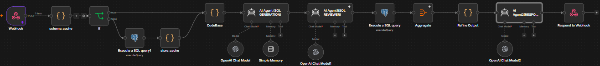

# TheFinPedia Executive Dashboard — AI Data Assistant

An n8n-powered chatbot that lets users ask plain-English questions about TheFinPedia's business and engineering data (revenue, subscriptions, customer support, defect metrics) and get accurate, formatted answers — without writing SQL.

Embedded directly into the Streamlit Executive Dashboard as a floating chat popup, with multi-session history, markdown tables, and query feedback logging.

---

## Architecture
 

 
**Flow:** `Webhook` → `schema_cache` → `If` (cache hit/miss) → *(miss only: `Execute a SQL query1` → `store_cache`)* → `CodeBase` → `AI Agent` (SQL generation) → `AI Agent1` (SQL review) → `Execute a SQL query` → `Aggregate` → `Refine Output` (formatting) → `AI Agent2` (natural-language composer) → `Respond to Webhook`
---

## How it works

### 1. Schema caching (`schema_cache` → `If` → `Execute a SQL query1` → `store_cache`)
Rather than querying `information_schema` on every message, the full database schema is cached in n8n's workflow static data (`$getWorkflowStaticData`) for 1 hour. A separate scheduled workflow keeps the underlying `schema_cache` Supabase table fresh in the background. This means most chat requests skip the Postgres schema lookup entirely.

### 2. Schema filtering (`CodeBase`)
Rather than injecting all ~130 tables into every prompt, this Code node scores each table by keyword relevance to the question and keeps only the top ~15 most relevant tables. It also:
- Force-includes `invoices`/`users`/`subscriptions` whenever the question has a time dimension (these are the only tables with both a date column and entity foreign keys).
- Detects referential follow-up questions ("this trend", "that", "it") and merges in the previous question's context, so multi-turn conversations don't lose their subject.

### 3. SQL generation (`AI Agent`)
Generates PostgreSQL from the filtered schema + user question, following a strict rule-based system prompt covering: date-handling patterns, table-selection priority, alias/JOIN validation, subquery scope, string-matching safety (ILIKE over exact match), sort-direction correctness, and financial-year logic.

### 4. SQL review (`AI Agent1`)
A second model pass that checks the generated query against a fixed checklist (JOIN-before-WHERE ordering, subquery alias scope, invented columns, unverified string filters, missing SELECT columns for GROUP BY, sort direction) and returns a corrected query if needed.

### 5. Execution (`Execute a SQL query`)
Runs the reviewed query against Supabase/Postgres.

### 6. Formatting (`Aggregate` → `Refine Output`)
A Code node that:
- Humanizes column names (`avg_revenue_last_3_months` → "Average revenue last 3 months")
- Formats currency with ₹ and Indian-style comma grouping (`12,00,000.00`)
- Formats percentages, dates (`March 2025`, timezone-corrected for IST), and plain integers appropriately
- Renders multi-row results as markdown tables

### 7. Natural-language composition (`AI Agent2`)
Rewrites the formatted data into a conversational answer, in the voice of a friendly data analyst — while never altering the underlying numbers or table structure.

### 8. Response (`Respond to Webhook`)
Returns the final formatted, natural-language answer as JSON.

---

## Companion workflows

| Workflow | Purpose |
|---|---|
| **Schema Refresh** | Scheduled job that queries `information_schema` and upserts the results into the `schema_cache` Supabase table. |

---

## Setup

### Prerequisites
- n8n instance (self-hosted or cloud), reachable via a stable URL (production: hosted; local dev: ngrok tunnel)
- Supabase/PostgreSQL database with your schema
- OpenAI API credentials configured in n8n (one credential, reused across all three AI Agent nodes)

### Required Supabase tables
```sql
CREATE TABLE public.schema_cache (
  id int PRIMARY KEY DEFAULT 1,
  schema_json jsonb NOT NULL,
  updated_at timestamptz DEFAULT now(),
  CONSTRAINT singleton CHECK (id = 1)
);
```

### Environment
- Webhook path: `/webhook/dashboard-chat`
- Workflow must be **Active** for the production URL to respond.

### Streamlit integration
The dashboard imports a `chat_widget.py` component that renders the assistant as a popover in the sidebar, with:
- Multi-session chat history ("New Chat" / history switcher)
- Markdown table + chart rendering

Set the webhook URL at the top of `chat_widget.py`:
```python
WEBHOOK_URL = "https://<your-n8n-domain>/webhook/dashboard-chat"
```

---

## Extending the fast-path system

For frequently-asked, verified-correct questions, add an entry to the `FAST_PATHS` array in `CodeBase` (or a preceding Code node) to skip SQL generation entirely and return a pre-verified query:

```javascript
{
  match: (q) => q.includes('average revenue') && q.includes('partner') && q.includes('3 month'),
  sql: `SELECT ... /* verified query */ ...`
}
```

This guarantees correctness and reduces latency/cost for common questions, while the AI Agent + reviewer pair remains the fallback for anything novel.

---

## Known limitations

- Free-tier ngrok tunnels are not permanent — the URL changes on restart unless a static domain is reserved.
- The SQL reviewer improves reliability but does not guarantee correctness on every possible question; genuinely new query shapes should be spot-checked before being trusted for reporting.
- Schema cache TTL is 1 hour by default — schema changes take up to that long to propagate unless the cache is manually invalidated.

---

## Tech stack

- **Orchestration:** n8n
- **Database:** Supabase (PostgreSQL)
- **Models:** OpenAI (GPT) — one model instance per step (SQL generation, SQL review, response composition), allowing each to be tuned/swapped independently based on speed vs. accuracy needs per task
- **Frontend:** Streamlit (Python)
- **Visualization:** Plotly (chart branch), native markdown tables
